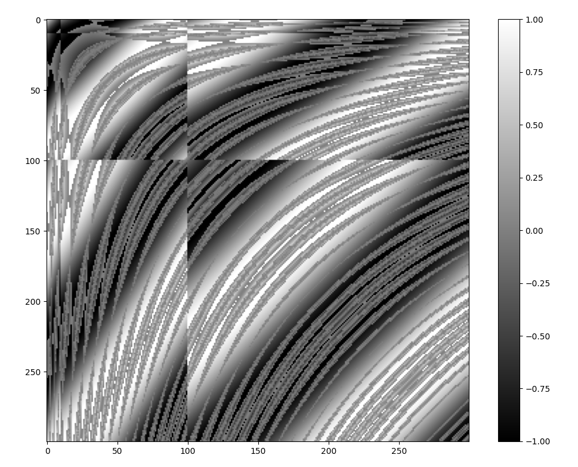

# Math-2D-Noise-Generator-for-Python-v1.0.0
Very quick procedural 2D noise generator made only using math functions.

**!!!This version (1.0.0) has problem with generating values for X and Y that are negative or extremely big!!! You can generate them but terrain can look strange!!!**

## Documentation
### Download and import
Simply download the file and place it in your projekt folder. In this file there are two separate generators witch generate different kind of terrain.

---

Import **Flow** generator like this:

```
from MathNoiseGenerator import Flow
```

Import **Rice** generator like this:

```
from MathNoiseGenerator import Rice
```
---

### Usage

```
from MathNoiseGenerator import Rice

generator = Rice(2137, 2.1) #seed 2137 sharpness set to 2.1

val = generator(21, 37) #storing noise value for coordinates x = 21, y = 37
```

```
from MathNoiseGenerator import Flow

generator = Flow(2137, 2.1) #seed 2137 sharpness set to 2.1

val = generator(21, 37) #storing noise value for coordinates x = 21, y = 37
```

**Both noises generate values from 1.0 to -1.0**

**You can change seed and sharpness of noise after initiation of noise class.**
```
from MathNoiseGenerator import Rice

generator = Rice(2137, 2.1)

val = generator(21, 37)

generator.seed = 3721 #changing seed
generator.sharpness = 1.7 #changing sharpness

val2 = generator(21, 37) #generating value for same point but with different sharpness and seed
```

```
from MathNoiseGenerator import Flow

generator = Flow(2137, 2.1)

val = generator(21, 37)

generator.seed = 3721 #changing seed
generator.sharpness = 1.7 #changing sharpness

val2 = generator(21, 37) #generating value for same point but with different sharpness and seed
```

## Diferences between Flow and Rice generators

Here is example of heightmap generated with same seed and sharpness by Rice and Flow.

**Flow:**


**Rice:**


